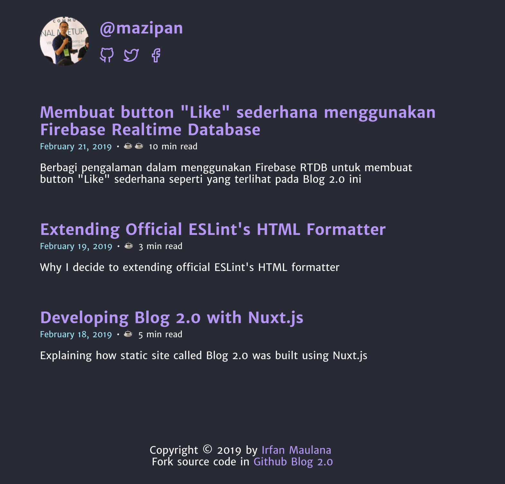

# 🗣 Blog-2.0

[](https://standardjs.com) [](https://www.codacy.com/app/mazipan/blog-2.0?utm_source=github.com&utm_medium=referral&utm_content=mazipan/blog-2.0&utm_campaign=Badge_Grade) [](https://codecov.io/gh/mazipan/blog-2.0)  [](https://travis-ci.org/mazipan/blog-2.0) 

> A personal blog by Irfan Maulana built with Nuxt.js

## Live

<https://www.mazipan.xyz>

## Logo


Raw file in this [vectr.com link](https://vectr.com/mazipan/i7V7tBB5z.png?width=512&height=512&select=i7V7tBB5zpage0)

## Screenshoot

|                Homepage               |            Post Detail            |
| :-----------------------------------: | :-------------------------------: |
|  |  |

## Firebase Setup

We use `Firebase` Real Time Database, so you need to create file `.env` before running this project in your local.

```bash
FIREBASE_API_KEY= your firebase `apiKey` config
FIREBASE_AUTH_DOMAIN= your firebase `authDomain` config
FIREBASE_DATABASE_URL= your firebase `databaseURL` config
FIREBASE_PROJECT_ID= your firebase `projectId` config
FIREBASE_STORAGE_BUCKET= your firebase `storageBucket` config
FIREBASE_MESSAGING_SENDER_ID= your firebase `messagingSenderId` config
```

Create DB in Firebase Database with your own name, and import from file `firebase-db-export.json` in this project.

## Build Setup

```bash
# install dependencies
$ yarn install

# serve with hot reload at localhost:3000
$ yarn dev

# generate static project
$ yarn generate
```

For detailed explanation on how things work, checkout [Nuxt.js docs](https://nuxtjs.org).

## Thanks for these awesome repo

-   [Dracula Theme](https://github.com/dracula/dracula-theme)
-   [Marinaaisa](https://github.com/marinaaisa/marinaaisa-website-2018)
-   [Overreacted.io](https://overreacted.io/)

* * *

Copyright © 2019 by Irfan Maulana
